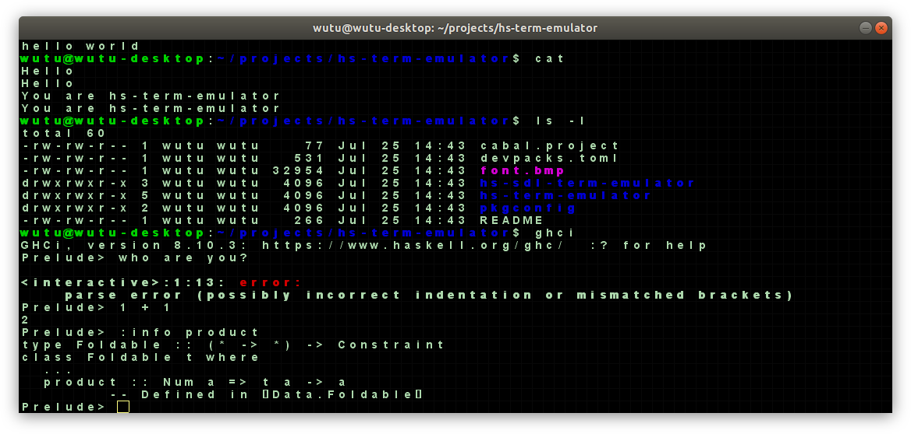
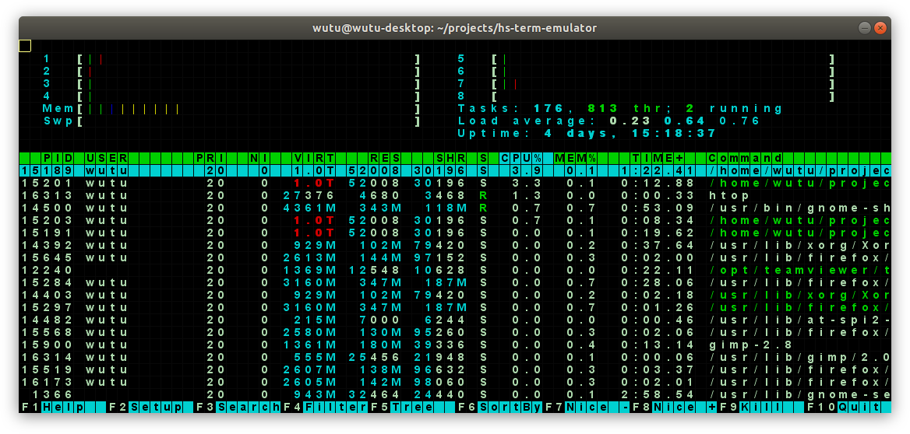
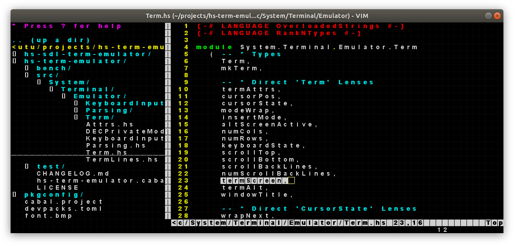

# hs-term-emulator

This is a Terminal Emulator (like xterm) implemented entirely in Haskell.

There are two packages:

1.  [hs-term-emulator](https://hackage.haskell.org/package/hs-term-emulator):
    This is a "pure" package that does no Input/Output and has no actual GUI.
  
    It provides a data structure representing the state of a terminal (See
    [System.Terminal.Emulator.Term](https://hackage.haskell.org/package/hs-term-emulator-0.1.0.4/docs/System-Terminal-Emulator-Term.html)),
    and functions for parsing the terminal output bytestream and updating the
    'Term' datastructure.
    
    It also has functions for translating user KeyPress actions from a typical
    physical keyboard into the correct escape sequences that should be fed
    back into the terminal pty.

2.  [hs-sdl-term-emulator](https://hackage.haskell.org/package/hs-sdl-term-emulator):
    A proof-of-concept implementation of a real usable terminal.

    This builds upon the previous package, and uses the
    [sdl2](https://hackage.haskell.org/package/sdl2) package to create a
    desktop window that renders the contents of the terminal. It also listens
    to keyboard presses and sends them back into the terminal.
     

## Screenshots

## Misc Development Tricks

Here is a good ghci trick:

    :def! R \_ -> Prelude.return (":!clear\n:r\n:main")
    :R

Running `cabal-fmt`:

    $ mkdir -p ./.cabal/bin
    $ cabal v2-install cabal-fmt --installdir=./.cabal/bin --overwrite-policy=always
    $ ./.cabal/bin/cabal-fmt --version
